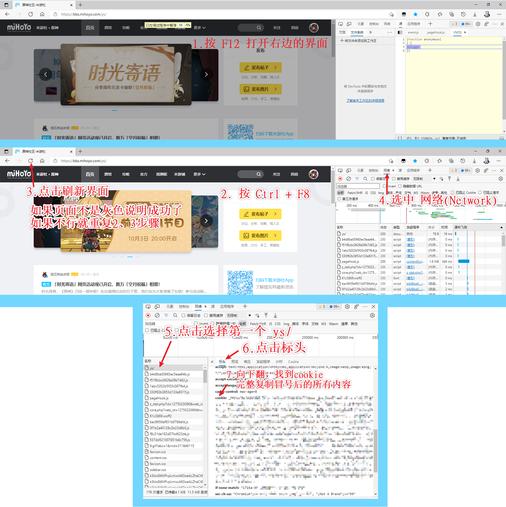

# genshin-sign-mirai-plugin

> 原神米游社签到 [Mirai](https://github.com/mamoe/mirai) 插件

## 简介
介于github上的原神签到项目大多都被干了，所以只能自己写一个了(

支持多用户(不建议), 多账号    
每天早7点左右进行签到，每个用户可以设置多个米游社账号，每个米游社账号可以绑定多个原神账号，会依次进行签到

支持崩坏3签到

## 声明
### 一切开发旨在学习，请勿用于非法用途
如果插件有安全方面的问题请及时联系我删除

## 使用
前往 [releases](https://github.com/Colter23/genshin-sign-mirai-plugin/releases) 下载插件，把插件放到plugin文件夹中    

启动私聊bot，发送 `原神签到` 按照提示进行设置，**请仔细阅读bot发的文字**

插件默认单用户模式，即只可以一个人使用，当第一个人配置成功，其他人再私聊bot `原神签到` bot将不在回应，不过第一个人仍可以继续添加米游社账号。

如果要改为多用户模式，请自行前往 config/GenshinSign/GenshinPluginConfig.yml 中修改mode的值

如果有其他建议或bug可以通过issues进行反馈

### 获取cookie

